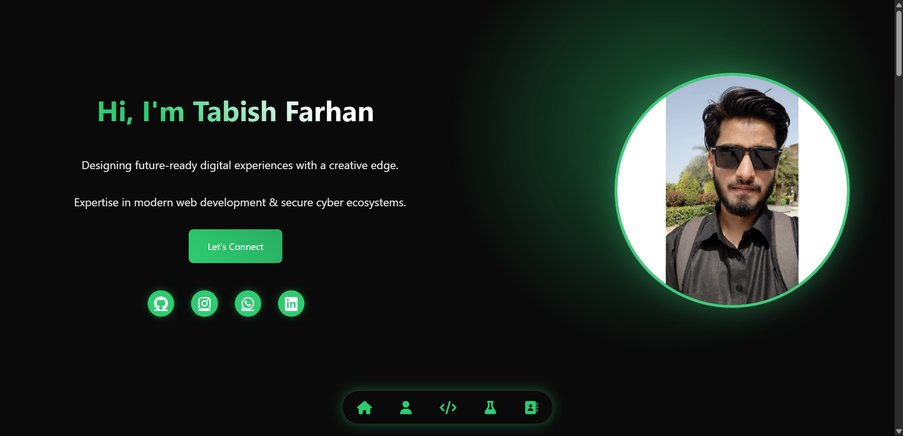
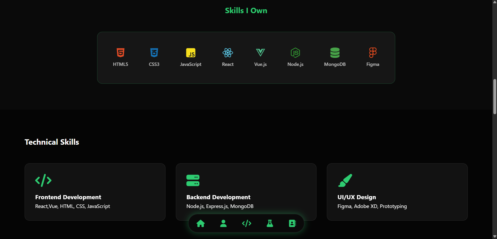
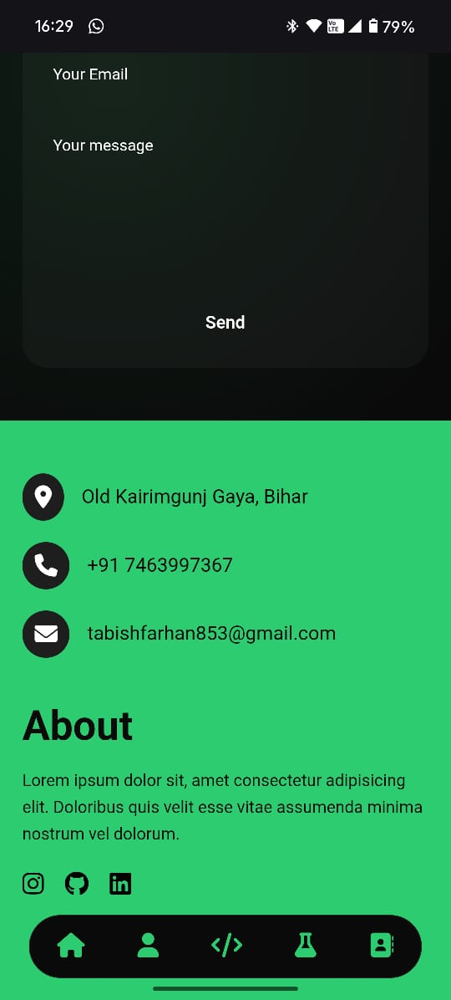
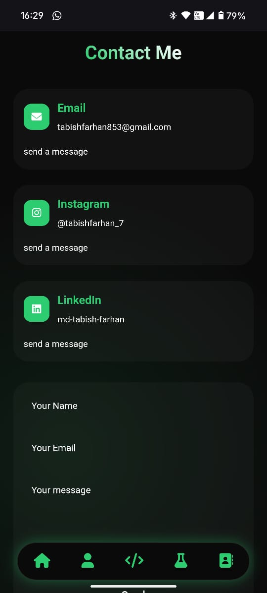

# 🌐 Tabish Farhan | Developer Portfolio

Welcome to my personal portfolio website, built to showcase my skills, projects, and contact details in a sleek and interactive interface.

## 🚀 Live Demo

🔗 [Visit Now](https://github.com/tabishfarhan7/My-Portfolio)

---

## 📸 Preview

Here are some screenshots of the site across sections:

| Home | Skills |
|------|--------|
|  |  |

| Projects | Contact |
|----------|---------|
|  |  |

| Footer | Mobile View |
|--------|-------------|
|  |  |

---

## 🛠️ Built With

- **HTML5**  
- **CSS3 / SCSS**  
- **JavaScript**  
- **Font Awesome Icons**  
- **Formspree** (for contact form submission)

---

## 💡 Features

- Responsive layout for all devices 📱💻  
- Animated text & transitions 🎨  
- Contact form with Formspree integration 📧  
- Social icons with external links 🔗  
- Modern floating bottom navbar 🧭

---

## 📬 Contact

Feel free to connect with me:

- [LinkedIn](https://www.linkedin.com/in/md-tabish-farhan/)
- [Instagram](https://www.instagram.com/tabishfarhan_7/)
- [GitHub](https://github.com/tabishfarhan7)

---

## 📂 Folder Structure (optional)

